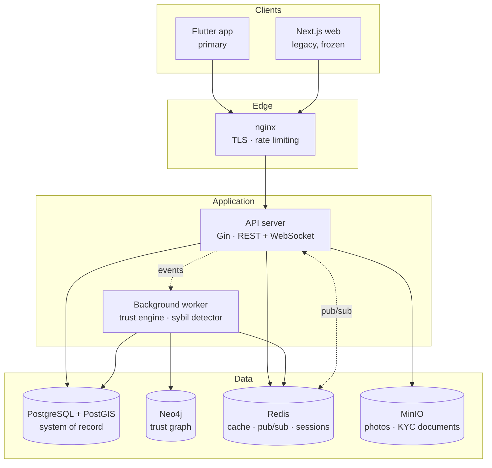

# TrueConnect

**A trust-graph matchmaking platform for the Kazakh Muslim community — where reputation is computed from a social graph rather than self-reported, and where the product's core constraint is religious rather than technical.**

Go backend · Flutter client · PostgreSQL/PostGIS · Neo4j · Redis · MinIO

---

## Why this project is not another dating app

Conventional dating platforms optimise for engagement: keep users swiping. That objective is actively hostile to the users this product serves, who are looking for marriage (*nikah*) and who operate under social norms that a Western dating UX cannot express — chaperoned conversation, guardian (*mahram*) involvement, and family introduction as an explicit milestone rather than an afterthought.

Two consequences shaped the entire system:

**1. Trust cannot be self-declared.** In a marriage context, a bad actor causes real social harm, and the community's existing solution — reputation by word of mouth — does not scale past a village. So trust had to become a computed, attack-resistant property of a graph, not a badge a user grants themselves. That decision is what pulled Neo4j into the stack and is the most technically substantial part of this codebase.

**2. The domain has irreducible structure.** *Mahram* registration, three-way chaperoned chat rooms, *madhab* (school of jurisprudence) compatibility, *niyyah* (intention) matching, imam-confirmed *nikah* — these are not feature flags on a generic matching engine. They are first-class bounded contexts, and modelling them as anything else produces a codebase that fights the domain.

---

## Architecture

A **modular monolith** in Go, following strict clean architecture. Dependencies flow one way only:

```
handler  →  service  →  repository (interface)  ←  adapter (implementation)
```

The `repository` layer is interfaces only. `adapter` holds the PostgreSQL, Neo4j, Redis and MinIO implementations. This means the service layer — where all business logic lives — has no knowledge of any database, and its tests run with hand-written mocks and no infrastructure at all.



### Why a modular monolith and not microservices

The trust engine, matching and chat all read from the same user and profile data, and the whole system is operated by a small team on a single VPS. Splitting into services would have bought independent deployment — which nobody needed — at the cost of distributed transactions across the exact boundaries that change most often. The bounded contexts are enforced in the package structure instead, so the seams exist and a future split is mechanical rather than archaeological.

---

## The trust engine

The headline problem: **make reputation resistant to Sybil attacks**, where an adversary registers many fake accounts to inflate their own score. A naive average rating fails immediately — 50 fake accounts each rating you 5 stars beats any honest signal.

The engine treats ratings as a directed weighted graph in Neo4j, `(rater)-[:RATED {score}]->(rated)`, and computes a score in three stages.

### 1. Peer weighting — a rating is worth what the rater is worth

Each rating is scaled by two multipliers:

| Factor | Effect |
|---|---|
| **Identity weight** | Raters with `id_verified` or `photo_verified` KYC status count **1.5×**; unverified count 1.0× |
| **Trust weight** | The rater's own trust score, normalised — a rater at 80 has twice the influence of one at 40 |

```
rating_effective = score × w_identity × w_trust
```

This is the anti-Sybil mechanism, and it is structural rather than heuristic. Fake accounts have no verification and near-zero trust, so their weight collapses toward zero. An attacker cannot bootstrap influence without first acquiring genuine trust from already-trusted users — which is the thing they're trying to fake. The attack doesn't get harder; it gets *circular*.

### 2. Bayesian smoothing — one five-star rating is not a reputation

Without smoothing, a new account with a single 5-star rating outranks an established user with fifty 4.8s. Ratings are pulled toward a neutral prior (2.5/5, weighted as if it were 5 ratings):

```
smoothed = (average_effective × count + 2.5 × 5) / (count + 5)
```

The prior's weight decays naturally as real ratings accumulate, so the penalty on new users is real but temporary.

### 3. Scale

```
trust_score = smoothed × 20     →  0–100, integer
```

### Why this runs asynchronously

Recomputing a score touches a user's whole neighbourhood in the graph. Doing that inside the HTTP request that submits a rating would put Neo4j latency on a user-facing write path for no benefit — nobody needs their score updated in the same 200ms they rated someone.

Instead, `POST /v1/interactions` writes the interaction to PostgreSQL (the durable audit record) and emits an event. The `TrustEngine` worker consumes it, recomputes in Cypher, and fans the result out to three places, each for a different reason:

- **Neo4j** — graph source of truth for subsequent computations
- **PostgreSQL** — so trust can participate in ordinary SQL joins and `ORDER BY` on the matching query
- **Redis** — sub-millisecond reads for the swipe feed, which is the hottest path in the app

The same worker runs a 24-hour ticker for global recalculation and score decay, so trust reflects recent behaviour rather than accumulating forever.

### Sybil cluster detection

A separate scheduled worker runs **Louvain community detection** over the trust graph. Fake account farms have a characteristic topology: densely connected internally, almost no edges to the outside world, uniformly low verification. Clusters matching that shape are written to `social.sybil_clusters` and flagged `under_review` — excluded from matching, but surfaced for human moderation rather than auto-banned, because the false-positive cost of banning a genuine tight-knit friend group is high.

---

## Matching

Candidate selection is a single PostGIS query that composes geospatial, preference and religious filters, ordered by trust:

```sql
ST_DWithin(p.location, ST_SetSRID(ST_MakePoint($8,$9),4326)::geography, $10)
  AND ($11::text[] IS NULL OR p.niyyah::text = ANY($11))   -- intention
  AND ($12::text   IS NULL OR p.madhab::text = $12)        -- school of jurisprudence
  AND ($13::text[] IS NULL OR p.languages && $13)          -- language overlap
ORDER BY u.trust_score DESC, u.last_login_at DESC NULLS LAST
```

Two details worth noting. The location predicate is `NULL`-tolerant (`p.location IS NULL OR ...`) so users who decline location sharing stay visible rather than silently vanishing from everyone's feed — a privacy choice that shouldn't cost you the product. And already-seen candidates are excluded via **Redis sets** rather than a SQL `NOT IN` against a swipe history table, which keeps the query planner on the spatial index instead of degrading as swipe history grows.

---

## Data model

Two PostgreSQL schemas, deliberately separated:

**`social`** — users, profiles, posts, matches, messages, interactions, mahrams, mahram chat rooms, settings, reports, whisper reports, sybil clusters. 18 tables.

**`identity_vault`** — KYC verifications and an `access_log`. Isolated from application data so that identity documents sit behind a different access boundary, and every read is recorded. Storing passport scans in the same schema as post likes is how PII leaks.

33 SQL migrations, applied by a dedicated `migrate` container that runs to completion before the API starts.

All infrastructure is deployed on Kazakh soil — no foreign managed services touch PII, which is a regulatory requirement for this data class rather than a preference.

---

## Security

| Concern | Approach |
|---|---|
| Password storage | **Argon2id** — memory-hard, resistant to GPU cracking in a way bcrypt is not |
| PII at rest | **AES-256-GCM** — authenticated encryption, so tampering is detectable, not just unreadable |
| Sessions | Short-lived JWT access token (15 min) + refresh token as `HttpOnly; Secure; SameSite=Strict` cookie |
| Refresh tokens | Hashed in Redis, **one-time use with rotation** — a stolen refresh token is usable at most once, and reuse is detectable |
| Transport | TLS terminated at nginx, which also handles rate limiting |
| KYC access | Every read against `identity_vault` written to an append-only access log |

---

## Testing

**127 test functions across 19 test files**, concentrated in the service layer where the business logic lives. Because services depend on repository *interfaces*, these run against hand-written mocks — no database, no containers, no fixtures to maintain.

```bash
make test                                    # full suite, race detector on
go test ./internal/service/... -v            # one layer
go test ./internal/... -run TestAuthService  # one service
```

CI (GitHub Actions) builds both binaries, runs the suite with `-race`, and runs `go vet` on every push and pull request to `main`.

---

## Running it

Requires Docker and Docker Compose.

```bash
cp .env.example .env
# set ENCRYPTION_KEY (openssl rand -hex 32) and JWT_SECRET (32+ chars)

make docker-up      # postgres, neo4j, redis, minio, nginx, api, worker, migrations
make migrate-up
```

API on `http://localhost:8080`. OpenAPI spec in `api/`.

For the demo scenario — a full match-to-nikah flow in 90 seconds with two seeded users:

```bash
make seed-halal
flutter run -d android    # or -d chrome
```

Credentials and the scenario walkthrough are in [`docs/PIVOT_PLAN.md`](docs/PIVOT_PLAN.md).

---

## API surface

**60+ endpoints** across auth, profiles, matching, chat, social feed, KYC, reporting, and the domain-specific contexts:

- `/v1/mahram` — guardian registration and OTP verification
- `/v1/mahram-rooms` — three-way chaperoned chat
- `/v1/imams`, `/v1/matches/:id/nikah-confirm` — imam directory and marriage confirmation
- `/v1/whisper` — anonymous post-match feedback, feeding the trust graph
- `/v1/matches/:id/family-intro` — family introduction milestone

Real-time messaging over WebSocket at `/v1/ws`, with Redis pub/sub fanning messages across API instances and FCM push as fallback when a recipient is offline.

Full endpoint reference: [`api/openapi.yaml`](api/openapi.yaml)

---

## What I would change

Written honestly, because the interesting part of a system is usually where it's weakest.

- **The Bayesian prior constants are unjustified.** `2.5` and `C=5` were chosen by intuition, not fitted to data. With real interaction volume they should be estimated from the observed rating distribution. As it stands they're a defensible guess, not a result.
- **Louvain runs on the full graph.** Fine at current scale, wrong at 100k+ users. It should run incrementally over changed neighbourhoods, or move to a scheduled batch on a graph projection.
- **Trust events use an in-process Go channel.** That works for a single API instance and silently drops events if the worker restarts mid-queue. A durable queue — Redis Streams or NATS — is the correct answer before running more than one instance.
- **No integration test layer.** The service layer is well covered against mocks, but nothing exercises the real PostGIS queries or Cypher. Those are exactly where the subtle bugs live. Testcontainers would close this gap and is the first thing I'd add.
- **The Next.js web client is dead code.** Frozen at v6 when the product went mobile-first. It should be deleted rather than left to rot in the tree.
- **Sybil detection has never faced a real adversary.** It's sound in theory and validated on synthetic clusters. That is not the same as working.

---

## Repository layout

```
├── api/            OpenAPI specification
├── cmd/
│   ├── api/        HTTP server entrypoint
│   ├── worker/     Background worker (trust engine, sybil detector)
│   └── migrate/    Migration runner
├── internal/
│   ├── handler/    HTTP handlers, middleware, routing
│   ├── service/    Business logic — the layer that matters
│   ├── repository/ Interfaces only
│   ├── adapter/    postgres · neo4j · redis · minio · kyc implementations
│   ├── domain/     Entities, value objects, domain errors
│   ├── worker/     trust_engine.go · sybil_detector.go
│   └── pkg/        jwt · crypto · validator · logger · halalfilter
├── migrations/     33 SQL migrations
├── deployments/    Docker Compose, nginx config
├── docs/           ARCHITECTURE.md · REPUTATION_ENGINE.md
└── frontend/       Flutter client — 68 Dart files, 21 screens
```

**~17,000 lines of Go**, excluding the client.

---

## Team and attribution

Built as a final-year diploma project at **Astana IT University by a team of four**. All authors are credited in the thesis document accompanying the project.

**My contribution — Bakdaulet Rzakul:** system architecture and the Go backend. Specifically: the clean-architecture layering and bounded-context decomposition; the trust engine and its Neo4j graph model, including peer weighting, Bayesian smoothing and Louvain-based Sybil detection; the PostGIS matching query and its filter composition; the PostgreSQL data model and all 33 migrations; the WebSocket and Redis pub/sub real-time layer; and the authentication and encryption design (Argon2id, AES-256-GCM, refresh-token rotation).

The codebase was developed with AI-assisted tooling — [`CLAUDE.md`](CLAUDE.md) in the repository root is the working context file for it. Architecture, data modelling, and the trust algorithm design are my own; the tooling accelerated implementation against decisions already made.

---

## Documentation

- [`docs/ARCHITECTURE.md`](docs/ARCHITECTURE.md) — layers, data flows, deployment topology
- [`docs/REPUTATION_ENGINE.md`](docs/REPUTATION_ENGINE.md) — trust score derivation in full

## License

Proprietary — all rights reserved.
